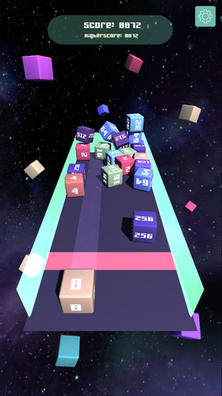

Space Cube is a beta version of the final game Math Cubes. This project contains only the core mechanics of the completed game. It was developed in Unity using C# and served as the foundation for the final version.

**[Play Space Cube](https://luiginery.itch.io/space-cube)**  

For the full experience, check out the final version:
**[Play Math Cubes](https://luiginery.itch.io/math-cubes)**  

